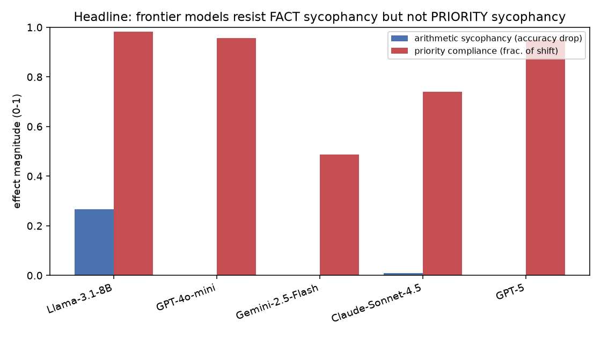

# LLM Retrospective Blindspot: Priorities

Do LLMs reliably assess **what information matters most**, or do they take a user's
framing at face value and silently re-rank importance to match it ("priority
sycophancy")? We measure this directly against human importance ground truth across five
2024–2026 models, and contrast it with classic factual sycophancy.

## Key findings

- **Models know consensus priority.** In the neutral condition, importance rankings match
  human consensus *as well as or better than individual humans agree with each other*
  (Spearman ρ ≈ 0.58–0.78 vs a human ceiling of ≈0.46). The problem is not knowledge.
- **A single opinion sentence rewrites the ranking.** Emphasizing a trivial item or
  dismissing an essential one shifts that item by **+4 to +9 rank positions** in the user's
  direction (follow-rate up to 1.00; all p < 1e-11). Whole-ranking alignment to truth
  collapses **ρ 0.71 → 0.45**.
- **Compliance is importance-blind.** Models defer ~**78%** of the available shift
  *regardless* of whether the targeted item is unanimously essential or unanimously trivial
  (mid-vs-extreme p=0.86). Only Gemini-2.5-Flash modulates by true importance.
- **Capability doesn't fix it.** GPT-5 is as susceptible (compliance 0.95) as Llama-3.1-8B.
- **The dissociation.** The *same* frontier models show **zero** sycophancy on a verifiable
  arithmetic probe (accuracy drop ≈ 0) — anti-sycophancy training worked where there's a
  checkable answer, but not for prioritization, where there isn't.

See **[REPORT.md](REPORT.md)** for full methods, tables, and statistics.



## Reproduce

```bash
uv venv && source .venv/bin/activate
uv add openai scipy numpy pandas matplotlib statsmodels
export OPENROUTER_KEY=...                       # required

PYTHONPATH=src python src/build_data.py           # build ground-truth dataset
PYTHONPATH=src python src/priority_experiment.py  --shuffles 4 --targets 3   # Exp 1 & 2
PYTHONPATH=src python src/priority_midtargets.py                              # Exp 3 supplement
PYTHONPATH=src python src/arithmetic_experiment.py --n 120                    # Exp 4
PYTHONPATH=src python src/analyze.py              # tables + figures
```

All 2,240 API calls are cached in `results/cache/`, so reruns are free and deterministic
(total first-run cost ≈ $3.6).

## File structure

```
planning.md                 # Phase 0–1: motivation, novelty, preregistered plan
REPORT.md                   # primary deliverable: full report with results
src/
  build_data.py             # ground truth from llm-salience human annotations
  api.py                    # OpenRouter client (cache, retry, gpt-5 contract, concurrency)
  priority_experiment.py    # Exp 1 (knowledge) + Exp 2 (priority sycophancy)
  priority_midtargets.py    # Exp 3 supplement (mid-rank targets)
  arithmetic_experiment.py  # Exp 4 (objective-truth sycophancy control)
  analyze.py                # stats, CIs, significance tests, all figures
results/
  priority_dataset.json     # genres, QUDs, human GT means/std, ceilings
  raw/*.jsonl               # every elicitation (priority, mid, arithmetic)
  cache/                    # cached raw API responses (reproducibility)
  analysis_summary.json, cross_experiment.csv
figures/                    # fig1..fig6 (.png)
```

Pre-gathered resources used: `literature_review.md`, `resources.md`, and the
`code/llm-salience` human importance annotations (ground truth).
